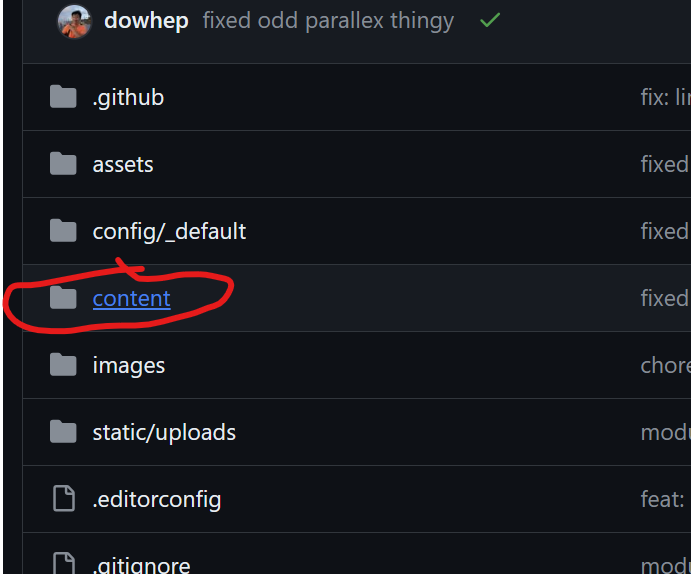
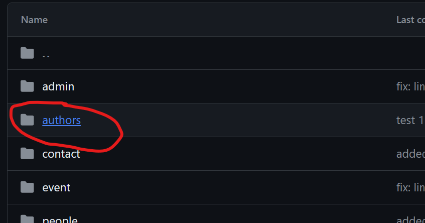
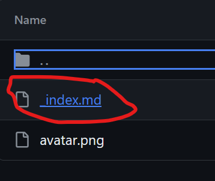
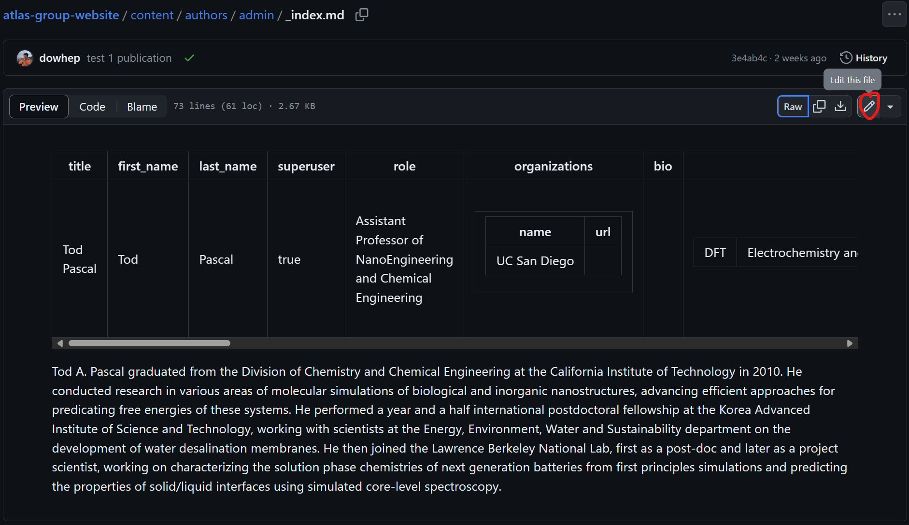
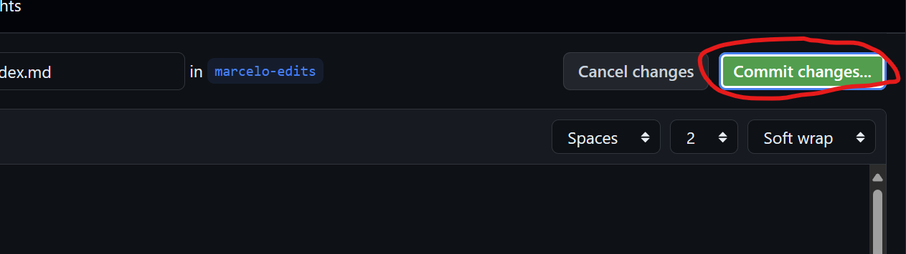
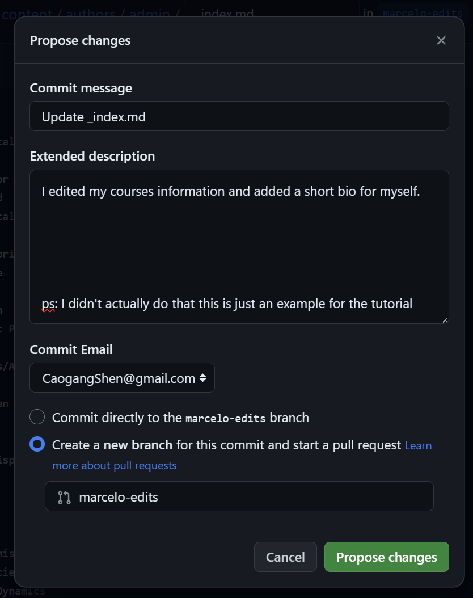
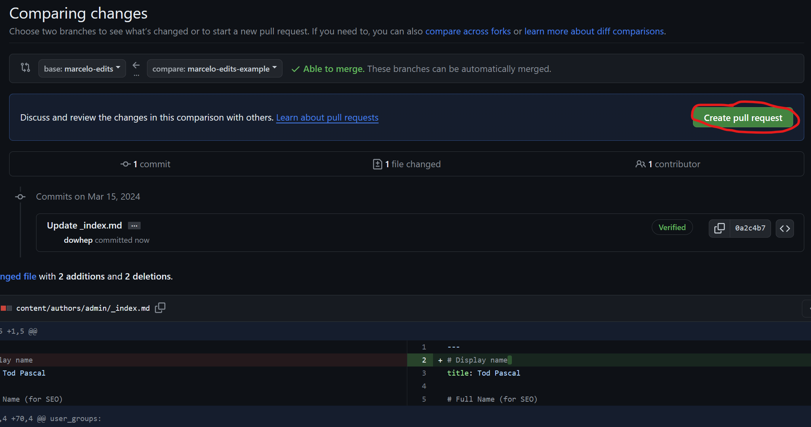
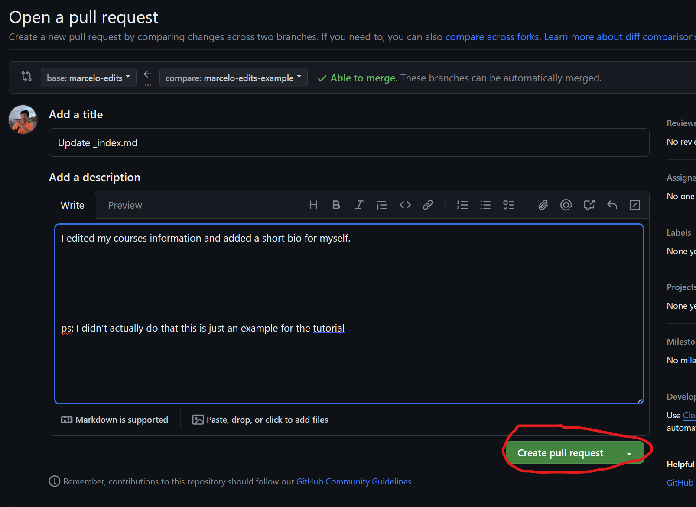
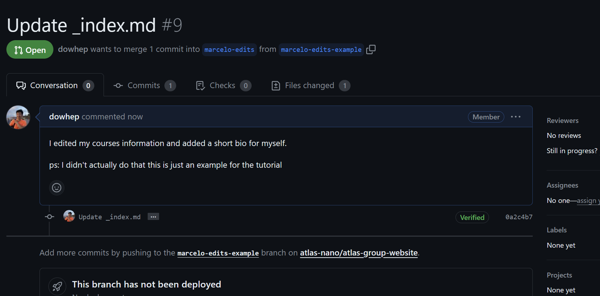

# [Atlas Research Group](https://atlas-nano.github.io/atlas-group-website/)

This repository contains the code base for the home page for the atlas group. Feel free to make pull requests to edit your corresponding part of personal information!

## How to make edits to my information?

To do that, we should edit our corresponding file from "content/authors/\[your name\]" folder, put it into a new branch, and create a pull request.

On the home page of our repository, select the "content" folder:

Select the "authors" folder:

Select the folder that correspond to your name. Then select the "_index.md" file:

Click on the edit button at the top right of the page:

And there, you can feel free to edit all the info you want to display on the group website!

After making all our changes, we will save the changes using the commit changes button on the top right of the page:

**IMPORTANT**: on the following menu that popped up, make sure to **select** "Create a new branch for this commit and start a pull request" and **name** your new branch \[your name\]-edits!

Then, fill in all the information regarding your changes (optional) and click "Commit changes":

> creating branches is the essence of git - it allows us to make draft edits to any code or information without affecting the website on runtime.

This will lead us to "Compare changes" page to create a new Pull Request (PR).

Click "Create pull request" to make our new pull request:

We will reach a page where we can double check all the changes that we have. Make sure that all the changes are what you wanted.

Confirm by clicking the "Create pull request" button:

You should see something similar to the following page:

Once you see that, we are good! The code owners will check and verify your changes and merge it to the website if everything looks good.

